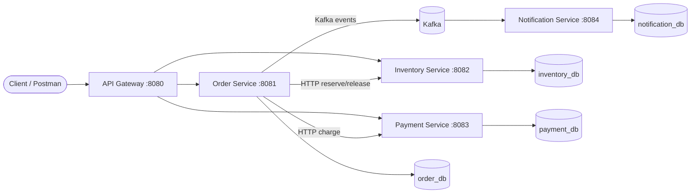
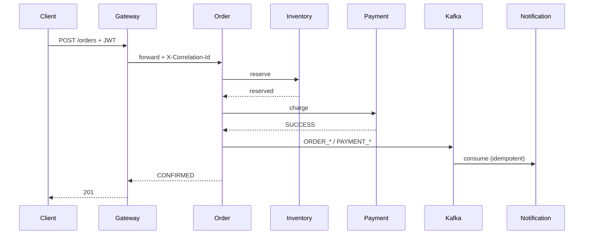

# Architecture

## Purpose

Interview-ready Order & Inventory system: few business features, clear enterprise patterns.

Full decision log: [decisions.md](decisions.md).

## Decisions (summary)

| Decision | Choice | Why |
|----------|--------|-----|
| Sync vs async saga | REST for reserve/pay; Kafka for notify | Easy to debug; saga steps are explicit |
| DB | PostgreSQL, one DB per service | Database-per-service without sharing entities |
| Gateway | Spring Cloud Gateway (Boot 2.5) | Routing + correlation ID + JWT |
| Auth | JWT at gateway only | Simple CUSTOMER/ADMIN |
| Locking | Optimistic `@Version` on inventory | Interview-friendly concurrency |
| Payment | Simulated + failure/delay toggles | Demo timeout/retry/circuit breaker |
| Java / Boot | Java 8 / Spring Boot 2.5.x | Interview constraint |
| Platform | No Redis / Eureka / K8s | Keep the story lean |

## System context



## Components

1. **API Gateway (`:8080`)** — routes, correlation ID, JWT login/authz.
2. **Order Service (`:8081`)** — order lifecycle; saga orchestration; Kafka producer.
3. **Inventory Service (`:8082`)** — stock; reserve/release; `@Version`.
4. **Payment Service (`:8083`)** — simulated charge; idempotency key.
5. **Notification Service (`:8084`)** — Kafka consumer; idempotent log.
6. **Kafka** — `order-events`, `payment-events`.

## Client entry

```
Client → API Gateway (:8080)
           ├─ /api/v1/auth/**       → Gateway (login)
           ├─ /api/v1/orders/**     → Order (:8081)
           ├─ /api/v1/inventory/**  → Inventory (:8082)
           └─ /api/v1/payments/**   → Payment (:8083)
```

Service-to-service calls (Order → Inventory/Payment) stay **direct** (not via gateway).

## Communication



## Local vs AWS topology

| Concern | Local | AWS (see [aws.md](aws.md)) |
|---------|-------|----------------------------|
| Apps + Kafka | Docker Compose | EC2 + Compose |
| Databases | Compose Postgres (4 DBs) or H2 | RDS PostgreSQL (4 DBs) |
| Artifacts / logs | Local disk | S3 + CloudWatch |
| Auth secrets | `.env` / defaults | SSM / Secrets Manager |

## What we deliberately skip

No Redis, Eureka, Kubernetes, 2PC, real PSP/email, shared domain JAR — see [decisions.md](decisions.md) non-goals.
