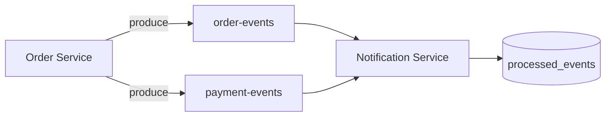

# Kafka

## Role

Async notifications only. Saga steps use REST so the flow stays easy to explain and debug.



## Local broker

```bash
docker compose -f docker-compose.kafka.yml up -d
# Full stack Kafka is also in docker-compose.yml (Phase 11)
```

Bootstrap: `localhost:9092` (host) / `kafka:29092` (Compose network)  
Disable producer in Order Service: `KAFKA_ENABLED=false`

## Topics

| Topic | Producers | Consumers |
|-------|-----------|-----------|
| `order-events` | Order Service | Notification Service |
| `payment-events` | Order Service | Notification Service |

## Event envelope

```json
{
  "eventId": "uuid",
  "eventType": "ORDER_CREATED",
  "timestamp": "2026-09-20T10:00:00Z",
  "orderId": 1001,
  "customerId": 2001,
  "payload": { "status": "INVENTORY_RESERVED", "totalAmount": 200.00 }
}
```

## Event types (published when)

| Event | When |
|-------|------|
| `ORDER_CREATED` | After inventory reserved |
| `ORDER_CONFIRMED` | Payment success |
| `ORDER_CANCELLED` | Cancel API |
| `PAYMENT_COMPLETED` | Payment success |
| `PAYMENT_FAILED` | Payment fail / payment down |

Partition key: `orderId`.

## Idempotency

Notification Service stores `eventId` in `processed_events` and skips duplicates (at-least-once delivery).
