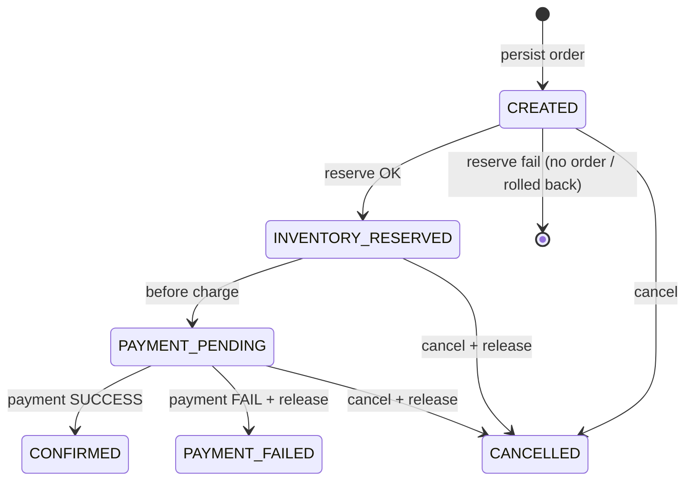

# Saga Pattern

## Problem

Order, Inventory, and Payment use separate databases. `@Transactional` cannot span them.

## Approach: orchestration by Order Service



Happy / fail path (text):

```
Create Order (CREATED)
        |
        v
Reserve Inventory ----fail----> fail create
        |
        v
INVENTORY_RESERVED → PAYMENT_PENDING
        |
        v
Process Payment
   | SUCCESS              | FAILED / unavailable
   v                      v
CONFIRMED           Release Inventory
                    PAYMENT_FAILED
```

## Compensating transaction

On payment failure or payment-service outage: call Inventory `release` for each line, then set `PAYMENT_FAILED`.

## Cancel

Allowed from `CREATED`, `INVENTORY_RESERVED`, `PAYMENT_PENDING`.  
If stock was reserved, cancel releases it.

## Demo

```bash
# Force payment failure (still returns 201 with status PAYMENT_FAILED)
curl -X POST http://localhost:8081/api/v1/orders \
  -H "Content-Type: application/json" \
  -H "X-Force-Payment-Failure: true" \
  -d "{\"customerId\":1001,\"items\":[{\"productId\":101,\"quantity\":1}]}"
```

## What we will not do

- 2PC / XA across services
- Shared local transaction
- Automatic rollback across DBs

See [decisions.md](decisions.md) ADR-001 / ADR-002.